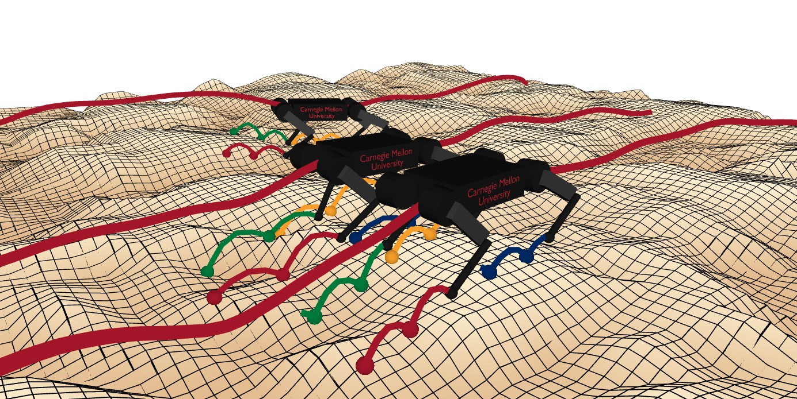

[](https://circleci.com/gh/robomechanics/quad-sdk/tree/main)

# Quad-SDK

## Overview

Quad-SDK is an open source, ROS-based full stack software framework for agile quadrupedal locomotion. The design of Quad-SDK is focused on the vertical integration of planning, control, estimation, communication, and development tools which enable agile quadrupedal locomotion in simulation and hardware with minimal user changes for multiple platforms. The modular software architecture allows researchers to experiment with their own implementations of different components while leveraging the existing framework. Quad-SDK also offers Gazebo simulation support and a suite of visualization and data-processing tools for rapid development. Refer to the [paper] for high-level details of the framework.

**Keywords:** Legged Robotics, Quadrupeds, Planning, Control, Leaping, ROS

### License

The source code is released under a [MIT License](LICENSE).

**Authors: Joe Norby, Yanhao Yang, Ardalan Tajbakhsh, Jiming Ren, Justin K. Yim, Alexandra Stutt, Qishun Yu, and Aaron M. Johnson<br />
Affiliation: [The Robomechanics Lab at Carnegie Mellon University](https://www.cmu.edu/me/robomechanicslab/)<br />
Maintainer: Ardalan Tajbakhsh, atajbakh@andrew.cmu.edu**

The packages in Quad-SDK have been tested under [ROS] Melodic on Ubuntu 18.04.
This is research code, expect that it changes often and any fitness for a particular purpose is disclaimed.




### Publications

If you use this work in an academic context, please cite the following publications:

* Repository: J. Norby, Y. Yang, A. Tajbakhsh, J. Ren, J. K. Yim, A. Stutt, Q. Yu, and A. M. Johnson. Quad-
SDK: Full stack software framework for agile quadrupedal locomotion. In ICRA Workshop on
Legged Robots, May 2022. ([paper])

        @inproceedings{abs:norby-quad-sdk-2022,
          author        = {Joseph Norby and Yanhao Yang and Ardalan Tajbakhsh and Jiming Ren and Justin K. Yim and Alexandra Stutt and Qishun Yu and Aaron M. Johnson},
          title         = {Quad-{SDK}: Full Stack Software Framework for Agile Quadrupedal Locomotion},
          booktitle     = {ICRA Workshop on Legged Robots},
          year          = {2022},
          month         = {May},
          type          = {workshop abstract},
          url_Info      = {https://leggedrobots.org/index.html},
          url_PDF       = {http://www.andrew.cmu.edu/user/amj1/papers/Quad_SDK_ICRA_Abstract.pdf},
          keywords      = {Control,Planning,Leaping}
        }
        
* Global Planner: J. Norby and A. M. Johnson, “Fast global motion planning for dynamic legged robots,” in 2020 IEEE/RSJ International Conference on Intelligent Robots and Systems (IROS). IEEE, 2020, pp. 3829–3836. ([paper](https://www.andrew.cmu.edu/user/amj1/papers/IROS2020_Fast_Global_Motion_Planning.pdf))

        @inproceedings{Norby2020,
	  	title={Fast global motion planning for dynamic legged robots},
	  	author={Norby, Joseph and Johnson, Aaron M},
	  	booktitle={2020 IEEE/RSJ International Conference on Intelligent Robots and Systems (IROS)},
	  	pages={3829--3836},
	  	year={2020},
	  	organization={IEEE}
		}


## Installation

Refer to the [Quad-SDK Wiki](https://github.com/robomechanics/quad-sdk/wiki/1.-Home) for installation instructions and dependency information. Currently Quad-SDK requires ROS Melodic on Ubuntu 18.04. All other dependencies are installed with the included setup script.

Run the unit tests with
```
roslaunch quad_utils load_params.launch
cd ~/catkin_ws
catkin run_tests
```

## Usage

Launch the simulation with:

```
roslaunch quad_utils quad_gazebo.launch
```

Stand the robot with:
```
rostopic pub /control/mode std_msgs/UInt8 "data: 1"
```
Run the stack with twist input:
```
roslaunch quad_utils planning.launch global_planner:=twist logging:=true
rosrun teleop_twist_keyboard teleop_twist_keyboard.py
```
Run the stack with global planner:
```
roslaunch quad_utils planning.launch global_planner:=fgmp logging:=true
```
Refer to the [Wiki](https://github.com/robomechanics/quad-sdk/wiki/2.-Launch,-Node,-and-Topic-Structure) page on launchfiles, nodes and topics for other configurations and arguments.

## Bugs & Feature Requests

Please report bugs and request features using the [Issue Tracker](https://github.com/ethz-asl/ros_best_practices/issues).


[paper]: https://www.andrew.cmu.edu/user/amj1/papers/Quad_SDK_ICRA_Abstract.pdf
[ROS]: http://www.ros.org
[rviz]: http://wiki.ros.org/rviz
[Eigen]: http://eigen.tuxfamily.org
[std_srvs/Trigger]: http://docs.ros.org/api/std_srvs/html/srv/Trigger.html
[sensor_msgs/Temperature]: http://docs.ros.org/api/sensor_msgs/html/msg/Temperature.html
