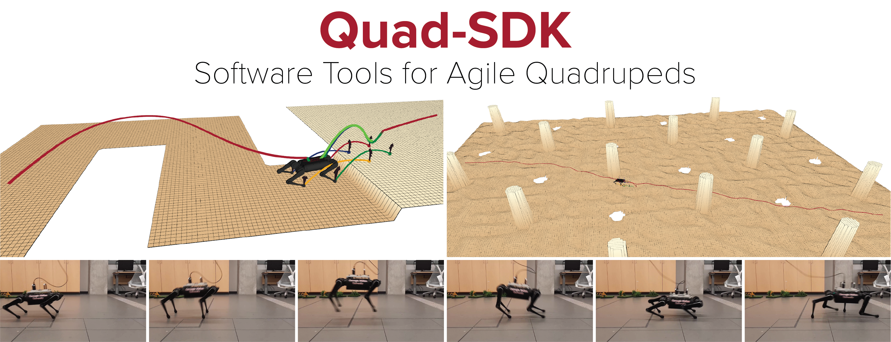

[](https://circleci.com/gh/robomechanics/quad-sdk/tree/main)


## Overview

Quad-SDK is an open-source, ROS2-based full-stack software framework for agile quadrupedal locomotion. It provides vertically integrated planning, control, estimation, communication, and development tools that enable agile locomotion in simulation and on hardware, with minimal user changes across multiple platforms. The modular architecture allows researchers to experiment with their own implementations of individual components while leveraging the rest of the stack. Quad-SDK supports both **Gazebo Harmonic** and **MuJoCo** simulation and ships a suite of visualization and data-processing tools for rapid development. Refer to the [paper] for a high-level description of the framework.

**Keywords:** Legged Robotics, Quadrupeds, Planning, Control, Estimation, Leaping, ROS2, Reinforcement Learning

### License

The source code is released under a [MIT License](LICENSE).

**Authors:** Joe Norby, Yanhao Yang, Ardalan Tajbakhsh, Jiming Ren, Justin K. Yim, Alexandra Stutt, Qishun Yu, Nikolai Flowers, and Aaron M. Johnson
**Affiliation:** [The Robomechanics Lab at Carnegie Mellon University](https://www.cmu.edu/me/robomechanicslab/)
**Maintainer:** David Ologan (dologan@andrew.cmu.edu)

Tested under **[ROS2] Jazzy on Ubuntu 24.04**. This is research code; expect frequent changes and no fitness for any particular purpose.

### Publications

If you use this work in an academic context, please cite the following as relevant:

* **Repository:** J. Norby, Y. Yang, A. Tajbakhsh, J. Ren, J. K. Yim, A. Stutt, Q. Yu, N. Flowers, and A. M. Johnson. "Quad-SDK: Full stack software framework for agile quadrupedal locomotion." *ICRA Workshop on Legged Robots*, May 2022. ([paper])

```bibtex
@inproceedings{abs:norby-quad-sdk-2022,
  author    = {Norby, Joseph and Yang, Yanhao and Tajbakhsh, Ardalan and Ren, Jiming and Yim, Justin K. and Stutt, Alexandra and Yu, Qishun and Flowers, Nikolai and Johnson, Aaron M.},
  title     = {Quad-{SDK}: Full Stack Software Framework for Agile Quadrupedal Locomotion},
  booktitle = {ICRA Workshop on Legged Robots},
  year      = {2022}
}
```

* **Global Planner:** J. Norby and A. M. Johnson, "Fast global motion planning for dynamic legged robots," in *2020 IEEE/RSJ IROS*, pp. 3829–3836. ([paper](https://www.andrew.cmu.edu/user/amj1/papers/IROS2020_Fast_Global_Motion_Planning.pdf))

```bibtex
@inproceedings{Norby2020,
  title={Fast global motion planning for dynamic legged robots},
  author={Norby, Joseph and Johnson, Aaron M},
  booktitle={2020 IEEE/RSJ International Conference on Intelligent Robots and Systems (IROS)},
  pages={3829--3836},
  year={2020},
  organization={IEEE}
}
```

## Installation

Quad-SDK requires ROS2 Jazzy on Ubuntu 24.04. A Docker-based install is also supported — see the [Wiki](https://github.com/robomechanics/quad-sdk/wiki). The included `setup.sh` installs all other dependencies.

```bash
cd ~/ros2_ws/src
git clone --recurse-submodules https://github.com/robomechanics/quad-sdk.git
cd quad-sdk && ./setup.sh
cd ~/ros2_ws && colcon build
source install/setup.bash
```

## Usage

Launch the simulator (Gazebo Harmonic or MuJoCo):

```bash
ros2 launch quad_utils quad_gazebo.py
ros2 launch quad_utils quad_mujoco.py
```

Stand the robot:

```bash
ros2 topic pub /robot_1/control/mode std_msgs/UInt8 "data: 1"
```

Run the planning stack (global planner, local planner, NMPC) with twist input:

```bash
ros2 launch quad_utils quad_plan.py
```

See the [Wiki](https://github.com/robomechanics/quad-sdk/wiki) for alternate configurations, hardware bringup, and per-platform notes.

## Packages

| Package | Purpose |
|---|---|
| [`global_body_planner`](global_body_planner/README.md) | RRT-Connect planner with mixed motion primitives (GBP-L). |
| [`local_planner`](local_planner/README.md) | NMPC-based body plan + Raibert footstep heuristic. |
| [`nmpc_controller`](nmpc_controller/README.md) | CasADi/IPOPT nonlinear MPC library. |
| [`robot_driver`](robot_driver/README.md) | Control loop, state estimation, hardware interface. |
| [`quad_utils`](quad_utils/README.md) | Kinematics/dynamics (**Pinocchio**), launch system, shared utilities. |
| [`quad_msgs`](quad_msgs/README.md) | Message definitions. |
| [`quad_simulator`](quad_simulator/README.md) | Gazebo plugins, worlds, and robot descriptions. |
| [`quad_logger`](quad_logger/README.md) | Bag recording and log post-processing (Python + MATLAB). |
| [`body_force_estimator`](body_force_estimator/README.md) | Momentum-based external wrench observer. |
| [`force_applicator`](force_applicator/README.md) | Runtime disturbance injection for robustness testing. |
| [`quad_training`](quad_training/README.md) | Time-sync + episode management for RL/BC data collection. |
| [`quad_perf_tests`](quad_perf_tests/README.md) | Performance-testing utilities (e.g. `cmd_vel` publisher). |
| [`scripts`](scripts/README.md) | Blender visualization / rendering scripts. |

## Recent Changes

- **ROS2 Jazzy migration.** All packages now build with `ament_cmake` / `ament_python`. ROS1 `roslaunch`/`catkin` commands in older material no longer apply — use `ros2 launch` / `colcon`.
- **Pinocchio replaces RBDL** for kinematics and dynamics (see `quad_utils::QuadKD2`). RBDL files are retained in-tree for reference but are not linked by the current build.
- **Gazebo Harmonic** replaces Gazebo Classic; MuJoCo back-end added.
- **Additional platforms:** Go1, Go2, Go2-W, B2, Spot, Vision60, and the Underbrush research platform.
- **Training infrastructure** (`quad_training`) and **performance tests** (`quad_perf_tests`) have been added for reproducible data collection.

## Bugs & Feature Requests

Please report bugs and request features using the [Issue Tracker](https://github.com/robomechanics/quad-sdk/issues).

[paper]: https://www.andrew.cmu.edu/user/amj1/papers/Quad_SDK_ICRA_Abstract.pdf
[ROS2]: https://docs.ros.org/en/jazzy/
