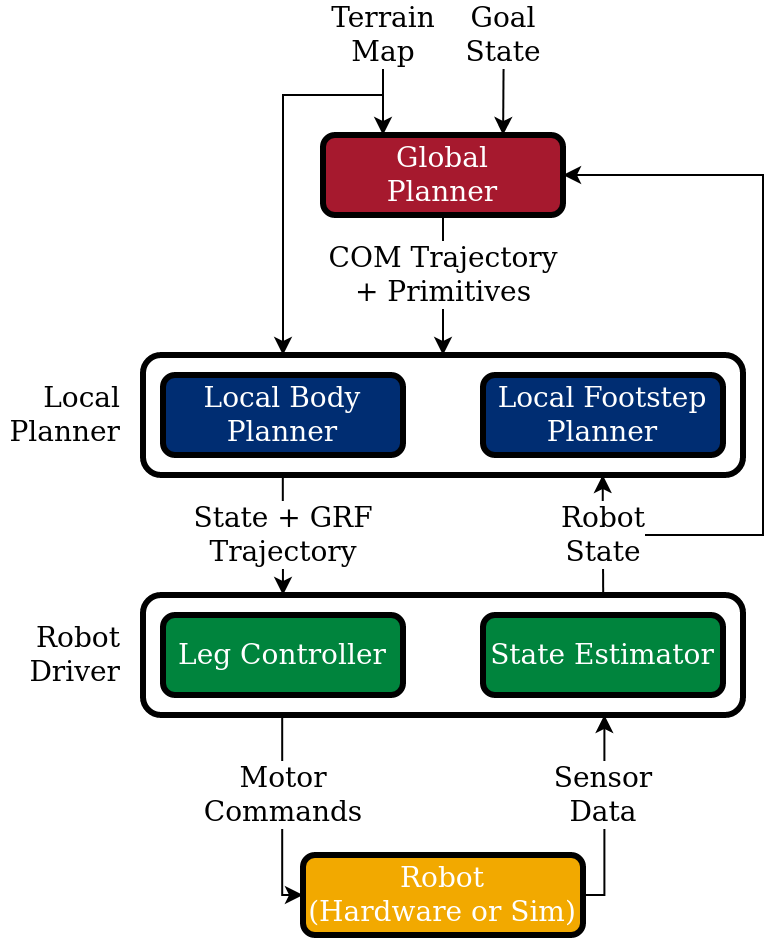
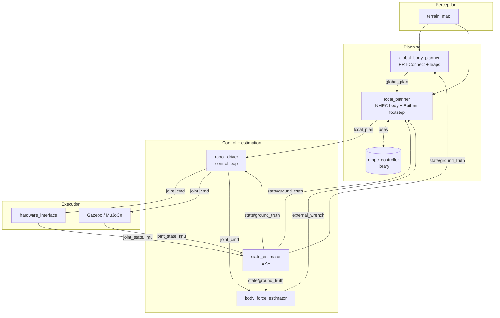

# Architecture Overview

Quad-SDK is a layered, message-driven stack. Each layer is a ROS 2 package with clear input/output topics, so individual layers can be swapped or studied in isolation.

{ .hero-image }

## The hierarchy



## Layer summary

| Layer | Frequency | What it produces | Where it lives |
|---|---|---|---|
| **Global plan** | 5–20 Hz | Path of body states + GRFs to a goal | [`global_body_planner`](../packages/global_body_planner.md) |
| **Local plan** | 333 Hz | 26-step NMPC body plan + footstep schedule | [`local_planner`](../packages/local_planner.md) |
| **NMPC** | called per local-plan tick | OCP solution (states, GRFs) | [`nmpc_controller`](../packages/nmpc_controller.md) |
| **Control** | 1 kHz | Per-joint torque/PD commands | [`robot_driver`](../packages/robot_driver.md) |
| **Estimation** | 1 kHz | Body state + foot contacts | [`robot_driver`](../packages/robot_driver.md) |
| **External wrench** | 100 Hz | Disturbance estimate | [`body_force_estimator`](../packages/body_force_estimator.md) |
| **Simulation** | 1–2 kHz | Joint states, IMU, contacts | [`quad_simulator`](../packages/quad_simulator.md) |

## Topic conventions

All robot-scoped topics are namespaced as `/robot_<id>/<topic>`. Multi-robot configs (see CBS demos) replicate the full stack under each namespace.

| Topic | Type | Producer → Consumer |
|---|---|---|
| `state/ground_truth` | `quad_msgs/RobotState` | estimator → planners, driver |
| `global_plan` | `quad_msgs/RobotPlan` | global → local planner |
| `local_plan` | `quad_msgs/LocalPlan` | local planner → driver |
| `foot_plan_continuous` | `quad_msgs/MultiFootPlanContinuous` | local planner → driver |
| `terrain_map` | `grid_map_msgs/GridMap` | perception → planners |
| `cmd_vel` | `geometry_msgs/Twist` | user → local planner |
| `control/mode` | `std_msgs/UInt8` | user → driver |

Full message definitions: [`quad_msgs`](../packages/quad_msgs.md).

## Launch composition

The runtime is composed by launch files under `quad_utils/launch/` rather than monolithic config:

```
quad_gazebo.py ─┐
                ├── robot_bringup.py ── robot_driver.py
quad_mujoco.py ─┘                       (per-robot)

quad_plan.py ──── planning.py ──── global_body_planner_node
                                ├── local_planner_node
                                ├── body_force_estimator (optional)
                                └── logging (optional)
```

Multi-robot scenarios pass a `robot_configs` JSON list as a launch argument; `robot_bringup.py` iterates and stamps namespaces. See `quad_utils/launch/robot_bringup.py`.

## Module deep-dives

- [ROS 2 migration](ros2-migration.md) — what changed from ROS 1, what to update if you're porting code.
- [Pinocchio integration](pinocchio-integration.md) — how the kinematics/dynamics layer was rewritten.

## Design choices worth knowing

!!! info "Why NMPC as a library?"
    `nmpc_controller` builds a CasADi/IPOPT solver once at startup and exposes a synchronous `solve()`. The local planner calls it directly so we avoid the latency and brittleness of a separate ROS node round-trip per control tick.

!!! info "Why split global vs. local planning?"
    Global search (~hundreds of milliseconds, RRT-Connect) and local refinement (~3 ms, NMPC) live on different timescales. Splitting them lets each be tuned and replaced independently.

!!! info "Why include both Gazebo and MuJoCo?"
    Gazebo is feature-rich (sensors, physics plugins, fluid contact). MuJoCo is fast, deterministic, and renders without a GPU — ideal for headless training rigs and perf tests.
