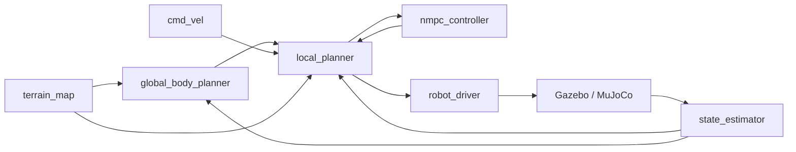

# Quickstart

Get a robot standing and walking in simulation in under five minutes.

!!! tip "Use Docker for the fastest path"
    The repo ships three Docker containers — **`x86`** for local development, **`arm-mpc`** and **`arm-learned`** for on-robot deployment. For this quickstart use the **`x86`** container; everything below assumes that environment. See [Installation → Docker install](installation.md#docker-install) for details.

## Prerequisites

- A successful build (see [Installation](installation.md))
- `~/ros2_ws/install/setup.bash` sourced in every terminal

## 1. Launch the simulator

=== "Gazebo Harmonic"

    ```bash
    ros2 launch quad_utils quad_gazebo.py
    ```

=== "MuJoCo"

    ```bash
    ros2 launch quad_utils quad_mujoco.py
    ```

The robot will spawn in a default world. The clock is driven by sim time; check `ros2 topic echo /clock` if downstream nodes look stalled.

## 2. Stand the robot

In a second terminal:

```bash
ros2 topic pub /robot_1/control/mode std_msgs/UInt8 "data: 1" --once
```

`mode 1` puts the controller into **STAND**. The robot ramps to its nominal stance pose using the `robot_driver` PD controller.

| Mode | Meaning |
|---|---|
| `0` | SAFETY — torques zero |
| `1` | STAND — track nominal stance pose |
| `2` | WALK — track plan published on `local_plan` |

## 3. Run the planning stack

In a third terminal:

```bash
ros2 launch quad_utils quad_plan.py
```

This brings up the global planner, local planner, NMPC, and (optionally) the body force estimator. Once it's running, switch the robot to walk:

```bash
ros2 topic pub /robot_1/control/mode std_msgs/UInt8 "data: 2" --once
```

## 4. Drive the robot

There are three ways to send velocity commands to the robot:

=== "Keyboard (teleop_twist_keyboard)"

    ```bash
    ros2 run teleop_twist_keyboard teleop_twist_keyboard \
      --ros-args --remap cmd_vel:=/robot_1/cmd_vel
    ```

    Key map:

    | Keys | Effect |
    |---|---|
    | `u i o` / `j k l` / `m , .` | Linear + angular velocity (3×3 grid; `k` is stop) |
    | `q` / `z` | Increase / decrease *both* speed scales by 10% |
    | `w` / `x` | Adjust **linear** speed only |
    | `e` / `c` | Adjust **angular** speed only |
    | any other key | Stop |

    Holding a key publishes continuously. Release returns to zero.

=== "Joystick (joy_node)"

    Plug in an Xbox / PS / 8BitDo controller and launch with `twist_input:=joy`:

    ```bash
    ros2 launch quad_utils quad_plan.py twist_input:=joy
    ```

    Default mapping (Xbox layout):

    | Stick / button | `cmd_vel` field |
    |---|---|
    | Left stick — vertical | `linear.x` (forward / back) |
    | Left stick — horizontal | `linear.y` (strafe) |
    | Right stick — horizontal | `angular.z` (yaw) |
    | RB (right bumper, deadman) | Must be held to enable motion — release = stop |
    | A | Stand mode |
    | B | Sit mode |
    | Start | Restart from safety |

    Adjust the deadman, axis indices, and scale factors in `quad_utils/config/joy_teleop.yaml`.

=== "RViz Publish-Point"

    Click anywhere on the terrain in RViz with the **Publish Point** tool. The global planner picks it up via `/clicked_point` and produces a path the local stack tracks.

The robot accepts whichever input is most recent — switching between keyboard, joystick, and RViz mid-run works without restarting nodes.

## What's running?



- **`global_body_planner`** — RRT-Connect with mixed motion primitives (jumps + steps) over a 2.5D terrain map.
- **`local_planner`** — produces a 26-step, 30 ms NMPC body plan plus a Raibert-heuristic footstep schedule.
- **`nmpc_controller`** — CasADi/IPOPT NMPC, callable as a library.
- **`robot_driver`** — control loop, EKF state estimation, hardware abstraction.

See [Architecture Overview](../architecture/overview.md) for a full topic graph.

## Logging the run

Add `--logging` to record bags into `~/.ros/bags/`:

```bash
ros2 launch quad_utils quad_plan.py logging:=true
```

Replay later with:

```bash
ros2 bag play ~/.ros/bags/<run_name>
```

Post-process with the [Quad Logger](../packages/quad_logger.md) tools (Python + MATLAB plotting).

## Next steps

- :material-rocket: [First Simulation Run tutorial](../tutorials/first-run.md) — guided walkthrough with screenshots
- :material-database: [Logging & Playback](../tutorials/logging.md)
- :material-robot: [Hardware Bringup](hardware-bringup.md)
- :material-school: [Training Data Collection](../tutorials/training.md)
