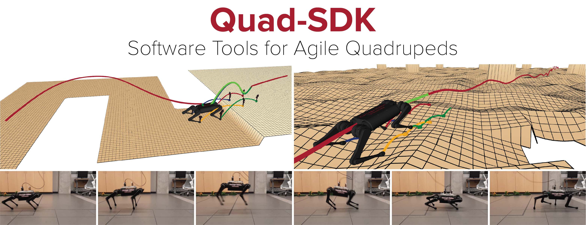

<div class="hero" markdown>

# Quad-SDK

**Open-source, ROS-based full-stack framework for agile quadrupedal locomotion.**

Vertically integrated planning, control, estimation, communication, and development tools — from simulation to hardware deployment, with minimal user changes across multiple platforms.

[Get started :material-rocket-launch:](getting-started/installation.md){ .md-button .md-button--primary }
[Source on GitHub :material-github:](https://github.com/robomechanics/quad-sdk){ .md-button }

{ .hero-image }

</div>

---

## What's inside

<div class="grid cards" markdown>

-   :material-map-marker-path:{ .lg .middle } **Planning stack**

    ---

    Long-horizon RRT-Connect global planner with mixed motion primitives, NMPC local body planner, Raibert-style footstep planner, and CBS-based multi-robot coordination.

    [:octicons-arrow-right-24: Global Body Planner](packages/global_body_planner.md)

-   :material-cog-sync:{ .lg .middle } **Control + estimation**

    ---

    Real-time control loop, EKF state estimation, and a momentum-based external wrench observer. Hardware abstraction supports Spirit, Go1, Go2, A1, A2, B2, Spot, and Vision60.

    [:octicons-arrow-right-24: Robot Driver](packages/robot_driver.md)

-   :material-tools:{ .lg .middle } **Simulation**

    ---

    First-class support for **Gazebo Harmonic** and **MuJoCo**, plus a beta **NVIDIA IsaacSim** backend. Force-injection plugins, perception terrain stack, multi-robot scenarios.

    [:octicons-arrow-right-24: Quad Simulator](packages/quad_simulator.md)

-   :material-database-cog:{ .lg .middle } **Logging + testing**

    ---

    Bag recording, MATLAB/Python post-processing, and reproducible headless batch-iteration + perf-test rigs.

    [:octicons-arrow-right-24: Quad Logger](packages/quad_logger.md)

</div>

---

## Quick start

```bash
cd ~/ros2_ws/src
git clone --recurse-submodules https://github.com/robomechanics/quad-sdk.git
cd quad-sdk
chmod +x setup.sh && ./setup.sh
cd ~/ros2_ws
colcon build --cmake-args -DCMAKE_BUILD_TYPE=Release
source install/setup.bash

# Launch
ros2 launch quad_utils quad_gazebo.py

# In a second terminal — stand the robot
ros2 topic pub /robot_1/control/mode std_msgs/UInt8 "data: 1" --once

# In a third terminal — start the planning stack
ros2 launch quad_utils quad_plan.py
```

[Full installation guide :octicons-arrow-right-24:](getting-started/installation.md)

---

## Cite this work

If you use Quad-SDK in academic work, please cite:

```bibtex
@inproceedings{abs:norby-quad-sdk-2022,
  author    = {Norby, Joseph and Yang, Yanhao and Tajbakhsh, Ardalan and
               Ren, Jiming and Yim, Justin K. and Stutt, Alexandra and
               Yu, Qishun and Flowers, Nikolai and Johnson, Aaron M.},
  title     = {Quad-{SDK}: Full Stack Software Framework for Agile
               Quadrupedal Locomotion},
  booktitle = {ICRA Workshop on Legged Robots},
  year      = {2022}
}
```

[Read the paper](https://www.andrew.cmu.edu/user/amj1/papers/Quad_SDK_ICRA_Abstract.pdf){ .md-button }

---

<div class="footer-credit" markdown>
Developed at the [Robomechanics Lab](https://www.cmu.edu/me/robomechanicslab/), Carnegie Mellon University. Released under the [MIT License](https://github.com/robomechanics/quad-sdk/blob/main/LICENSE).
</div>
