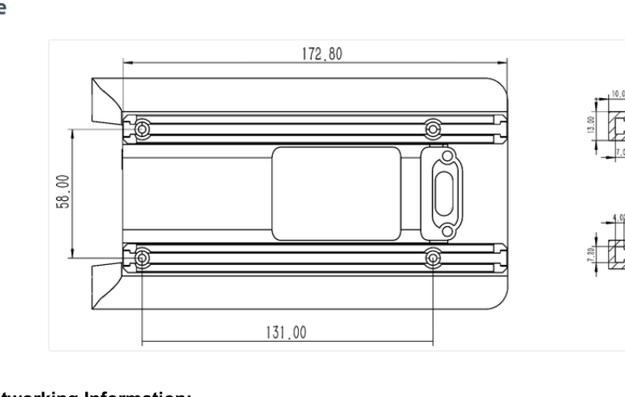

# :material-tools: Hardware Design

Mechanical and firmware notes for designing attachments and re-flashing the lab's Unitree fleet.

## Mounted rail dimensions

Top-of-back rail spec for designing custom attachments (sensor mounts, batteries, RC receivers):

{ loading=lazy }

Key dimensions:

| Dimension | Value |
|---|---|
| Outer rail span (length) | **172.80 mm** |
| Inner mounting span | **131.00 mm** |
| Rail width | **58.00 mm** |
| Rail cross-section height | **13.00 mm** (10.00 + 7.00 stack) |
| Rail width × thickness | **4.00 mm × 7.00 mm** (with **4.50 mm** clearance below cap) |

Measure twice on the actual robot before machining — Unitree has revised the rail profile across SKUs and the diagram above is for the lab's current Go2 hardware.

## Flashing Unitree robots with Jetpack 6.2.1

The lab's Go2s currently run Jetpack 6.2.1 on their onboard Jetsons. Re-flashing is occasionally required after firmware bumps or corrupted SD images.

Follow the official guide here: [Unitree Jetpack version guide](https://support.unitree.com/home/en/Go2/article/3HS2nfjfBHAQVCxn3ZD56u){target="_blank"}

!!! warning "Don't flash without a backup"
    The Jetson stores robot-specific calibration. **Image the SD before flashing** — `sudo dd if=/dev/mmcblk0 of=robot-name-pre-flash.img bs=4M status=progress`. Even a "clean" reflash can be undone faster from a backup than re-running calibration.

!!! tip "After flashing"
    1. Restore the netplan from [Networking](networking.md)
    2. Restore `/etc/chrony/chrony.conf` from [Time sync](time-sync.md)
    3. Reinstall Quad-SDK deps via `setup.sh`
    4. Re-run motor calibration per Unitree's guide

## Attachment design checklist

Before a new attachment leaves CAD:

- [ ] Mounting holes match the 131-mm inner rail span
- [ ] Mass + COM offset entered in the per-robot YAML so the NMPC weights compensate
- [ ] No protrusion below the back-rail plane (interferes with the carry-handle on the Go2)
- [ ] Cable strain relief — the Unitree rail vibrates significantly during dynamic gaits
- [ ] If holding a sensor: mocap markers added to the attachment (not the robot body) so they don't move relative to the sensor

## Maintainer

Mechanical questions: open an issue on the lab repo or contact the current student maintainer.

[:octicons-arrow-right-24: Back to RML hub](index.md)
