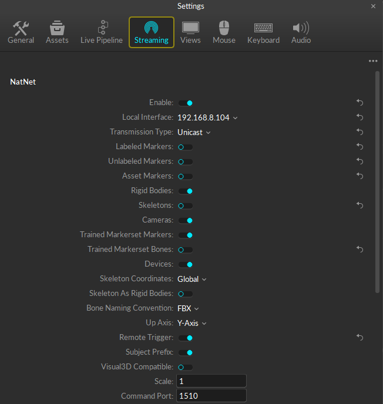
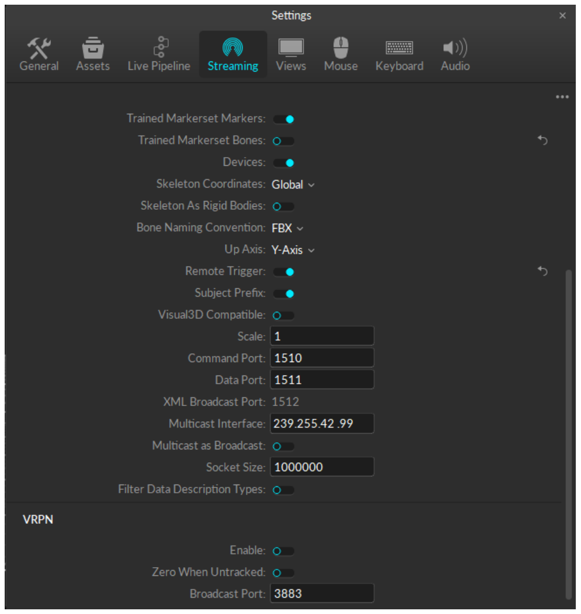
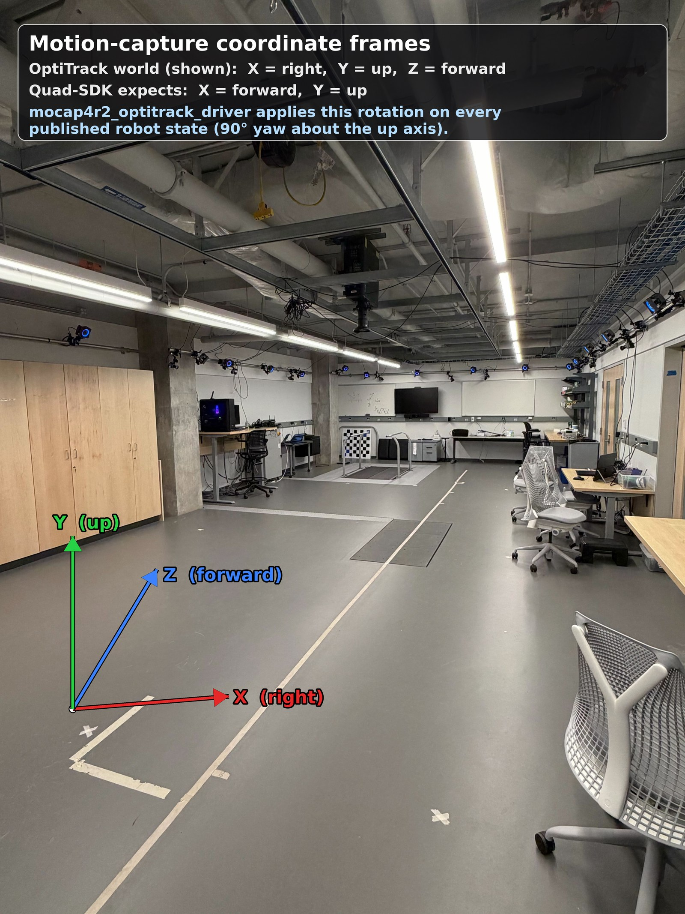
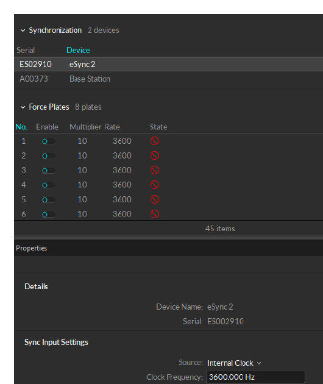

# :material-camera-control: Motion Capture Setup

The lab uses **Optitrack** cameras with **Motive** as the host software, streaming pose data over **NatNet** to the lab laptop / robot stack.

## NatNet streaming settings

In Motive → Settings → Streaming, configure NatNet exactly like this. Only the listed checkboxes should be on; ports must match downstream consumers.

{ loading=lazy }

{ loading=lazy }

| Field | Value |
|---|---|
| Enable | :material-check: |
| Local Interface | `192.168.8.104` |
| Transmission Type | **Unicast** — always; we never use multicast in this lab |
| Rigid Bodies | :material-check: |
| Cameras | :material-check: |
| Skeleton Coordinates | Global |
| Bone Naming | FBX |
| Up Axis | Y-Axis |
| Subject Prefix | :material-check: |
| Scale | `1` |
| Command Port | `1510` |
| Data Port | `1511` |
| XML Broadcast Port | `1512` |
| Multicast Interface | `239.255.42.99` |
| Socket Size | `1000000` |
| **VRPN Enable** | :material-close: |
| VRPN Broadcast Port | `3883` (kept for legacy) |

!!! note "Always Unicast"
    This lab uses **Unicast only** — never multicast, regardless of how many robots are running. Leave Transmission Type set to Unicast at all times; the Multicast Interface field below is unused in our setup.

## Defining a robot rigid body in Motive

1. Highlight the relevant marker grouping for your rigid body
2. In the **Builder** pane, click **Edit** → **Orientation**
3. Move the **COM** (diamond marker) onto the marker you want to anchor to
4. For the **back-left** marker on the standard Unitree mount, set the COM offset to:

| Axis | Offset |
|---|---|
| X | **40 mm** |
| Y | **-105 mm** |
| Z | **100 mm** |

The default Asset ID for Unitree robots in Motive is **5**.

For room calibration steps, see the separate **RML Mocap Guide**.

## Coordinate frames

OptiTrack and Quad-SDK do **not** use the same axis convention, so the two frames have to be reconciled before mocap poses are usable by the stack.

{ loading=lazy }

The OptiTrack world frame is anchored at the ground-plane calibration square (the L-marker on the floor):

| Axis | OptiTrack world | Quad-SDK |
|---|---|---|
| **X** | Right | **Forward** |
| **Y** | Up | Up |
| **Z** | Forward | Left |

In other words OptiTrack is **Z-forward / Y-up / X-right**, while Quad-SDK expects **X-forward / Y-up**. The difference is a 90° rotation (yaw) about the shared up axis.

!!! info "The driver handles the rotation for you"
    You do **not** apply this rotation yourself. The `mocap4r2_optitrack_driver` external dependency rotates every published robot state from the OptiTrack convention into the Quad-SDK convention, so downstream nodes (EKF, planners, controller) already receive poses in **X-forward / Y-up**. Just make sure the rigid body is defined with the COM offset above and the world is calibrated against the floor L-square.

## Camera frame rate (eSync 2)

Default target is **360 Hz**. If Motive caps you at ≤ 250 Hz, the eSync 2 device is configured for the wrong sync source.

{ loading=lazy }

In Motive → Devices → eSync 2 → Sync Input Settings:

| Field | Value |
|---|---|
| Source | **Internal Clock** |
| Clock Frequency | `3600.000 Hz` |
| Input Multiplier | `1` |
| Input Divider | `10` |
| Camera Rate | `360.000 Hz` (computed from above) |

Per-camera settings should all be:

- Enable: on
- Mode: tracking (crosshair icon)
- Exposure: `100 µs`
- LED: on

!!! warning "Throttled at 250 Hz? Drop the color-camera resolution"
    If Motive still caps the frame rate at 250 Hz even with the eSync 2 set correctly, lower the **resolution of the color cameras** — Motive limits the *whole system's* frame rate to whatever the color cameras can sustain. This applies **even when the color cameras are disabled**, so reduce their resolution regardless.

## UDP buffer sizing on the laptop

At 360 Hz Motive floods the network. If `chronyc` or `ros2 topic hz` shows packet drops or you see "receive buffer errors" in `netstat -s`, the kernel UDP buffer is too small (default 208 KB). Bump it to ~26 MB.

**Check current:**

```bash
sysctl net.core.rmem_max
sysctl net.core.rmem_default
```

**Temporary increase** (lost on reboot):

```bash
sudo sysctl -w net.core.rmem_max=26214400
sudo sysctl -w net.core.rmem_default=26214400
```

**Permanent increase:**

```bash
echo "net.core.rmem_max=26214400"     | sudo tee -a /etc/sysctl.conf
echo "net.core.rmem_default=26214400" | sudo tee -a /etc/sysctl.conf
```

The 26 MB number is empirical — at 360 Hz with all the cameras enabled it has cleared the receive-buffer errors on the laptop's NIC.

## Common failure modes

??? warning "Rigid body flickers / drops out"
    Marker visibility — the rigid body needs ≥ 3 markers visible at all times. Reposition cameras or add a redundant marker.

??? warning "Pose has constant offset from robot ground truth"
    COM-marker offset is wrong. Re-measure or reset using the offsets in the table above.

??? warning "ros2 topic hz on /mocap/.../pose shows < 100 Hz"
    Either the camera frame rate isn't 360 Hz (check eSync 2), or the UDP buffer is full (raise `rmem_max`), or the NIC is throttling. Run `ethtool -S <iface>` and look for `rx_dropped`.

[:octicons-arrow-right-24: Robot bringup](robot-bringup.md)
