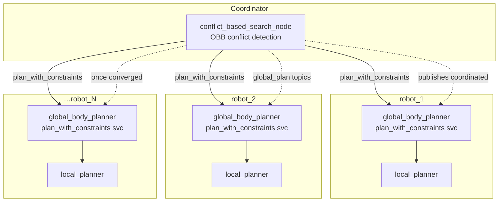

# Multi-Robot with Conflict Based Search

Run a fleet of quadrupeds simultaneously with coordinated, conflict-free global plans. The coordinator is the [`conflict_based_search`](../packages/conflict_based_search.md) (CBS) node, which sits above each robot's [`global_body_planner`](../packages/global_body_planner.md) and asks them to replan when their plans intersect.

## What it does



Each robot keeps its own planning + control stack. CBS sits *above* the global planners and:

1. Asks every robot's `plan_with_constraints` service for a fresh plan
2. Runs OBB-vs-OBB conflict detection across each timestep of those plans
3. On conflict, branches: adds a time-windowed pose constraint to one of the robots and asks it to replan
4. Repeats until either a conflict-free plan set is found or `max_iterations` is hit
5. Publishes the coordinated `/<robot>/global_plan` topics simultaneously

This page walks the canonical 3-terminal workflow.

## Prerequisites

- A successful build of `conflict_based_search`, `global_body_planner`, `local_planner`, and `quad_utils`
- Per-robot YAML configs in `quad_utils/config/<robot>.yaml` (Go2 ships with a working baseline)
- A world large enough for your fleet — `big_flat.sdf` is the default for the 8-robot demo

## 1. Spawn the world + N robots

```bash
ros2 launch quad_utils quad_multi_gazebo.py
```

This is the multi-robot equivalent of `quad_gazebo.py`. Defaults to an octagon-swap demo with 8 Go2s on `big_flat.sdf`. Override via `robot_configs:='[...]'`:

```bash
ros2 launch quad_utils quad_multi_gazebo.py robot_configs:='[
  {"name":"robot_1","type":"go2","controller":"inverse_dynamics",
   "init_pose":"-x -3 -y 0 -z 0.5 -Y 0",       "goal_state":"[3.0, 0.0]"},
  {"name":"robot_2","type":"go2","controller":"inverse_dynamics",
   "init_pose":"-x  3 -y 0 -z 0.5 -Y 3.14159", "goal_state":"[-3.0, 0.0]"}
]'
```

!!! warning "`goal_state` is required"
    Unlike single-robot planning, CBS requires every robot to declare a goal — without distinct goals there is nothing for CBS to resolve. `multi_robot.py` will fail loudly if a robot is missing it.

## 2. Stand each robot

```bash
ros2 topic pub --once /robot_1/control/mode std_msgs/UInt8 "data: 1"
ros2 topic pub --once /robot_2/control/mode std_msgs/UInt8 "data: 1"
# … etc per robot
```

A small shell loop helps with large fleets:

```bash
for n in robot_1 robot_2 robot_3 robot_4 robot_5 robot_6 robot_7 robot_8; do
  ros2 topic pub --once /$n/control/mode std_msgs/UInt8 "data: 1"
done
```

## 3. Launch per-robot planning + central CBS

```bash
ros2 launch quad_utils multi_robot.py
```

This is a thin wrapper around `quad_plan.py` that:

- starts a `global_body_planner` + `local_planner` per robot under their own namespace
- starts the central `conflict_based_search_node`
- forces every robot's `reference` to `gbpl` (twist-controlled robots can't participate — they don't have the `plan_with_constraints` service)
- enforces `goal_state` on each robot's config

## 4. Walk

Switch each robot to walk:

```bash
for n in robot_1 robot_2 robot_3 robot_4 robot_5 robot_6 robot_7 robot_8; do
  ros2 topic pub --once /$n/control/mode std_msgs/UInt8 "data: 2"
done
```

CBS publishes coordinated `/<robot>/global_plan` topics; the per-robot local planners take it from there.

## CBS-specific bagging

If you're diagnosing tracking failures or weird CBS convergence behaviour, append `logging_cbs:=true`:

```bash
ros2 launch quad_utils multi_robot.py logging_cbs:=true
```

This records a focused per-robot bag (global plan, local plan, ground truth, joint state, GRFs, control commands) under `${QUAD_LOGGER_SRC}/bags/cbs/`. It's off by default because the subscribers + serialisation cost a few percent CPU per robot, which on the saturated 8-robot demo can bias the failure pattern.

## Tuning

Key knobs live in `conflict_based_search/config/conflict_based_search.yaml`:

| Param | Default | Purpose |
|---|---|---|
| `robot_names` | `["robot_1","robot_2"]` | Robots whose `plan_with_constraints` services CBS will call |
| `max_iterations` | `500` | Hard cap on CBS expansions |
| `service_timeout_s` | `30.0` | Per-call timeout on `plan_with_constraints` |
| `warm_start` | `true` | Reuse RRT-Connect trees on replan (lazy-prune violators) instead of full rebuild |
| `body_length`/`width`/`height` | `0.70`/`0.35`/`0.35` m | OBB extents used for conflict detection |
| `update_rate` | `5.0` Hz | Polling rate while waiting on pending service futures |

Body extents assume a homogeneous fleet. If you mix platforms, size to the largest.

## Common failure modes

??? warning "CBS hits max_iterations and gives up"
    The coordinated set is infeasible at the current OBB sizing. Either widen the world, lower `body_*` extents (less conservative), or stagger goals. The "best-known" plan is still published with a warning so things don't lock up.

??? warning "Per-robot planner takes way longer on replan than on first solve"
    Likely tree warm-start is finding very few re-usable vertices. Try `warm_start: false` to confirm — if behaviour is the same, the constraints are deep enough that a rebuild was the right call anyway.

??? warning "Two robots' plans pass each other but Gazebo still collides them"
    OBB sweep currently checks aligned timesteps + midpoints. If your plan timestep is large vs robot velocity, narrow gaps can be missed. Reduce `dt` in the per-robot global-planner config.

??? warning "robot_N never appears in CBS output"
    Confirm `robot_N` is listed in `robot_names` and that its `plan_with_constraints` service is alive (`ros2 service list | grep plan_with_constraints`). A robot whose reference is `twist` won't have the service.

## See also

- [`conflict_based_search` package reference](../packages/conflict_based_search.md)
- [`global_body_planner` `plan_with_constraints` service](../packages/global_body_planner.md)
- [Architecture overview](../architecture/overview.md)
